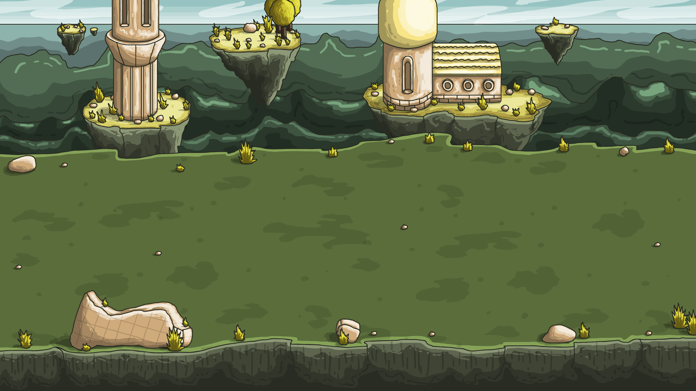

# Mage vs Assasins Platform Game
This is a Platformer Game where you are a mage that has to fight assasins, you move through a battleground and can attack to defeat the enimies or you can dodge them by jumping.

# How to run locally

* Clone the project run `npm install` and `npm run build`
* Open the generated index.html on the dist folder. 

# Live Demo [Mage vs Assasins](https://quizzical-bardeen-7ebe1a.netlify.app/)

## Elements

### Hero - Mage

### Mage - Attacking

### Enemy - Assasins

### Battlefield

# Instructions
You have to kill as many assasins as you can without touching them or falling from the platforms.

* Press right click to attack the assasins.
* Press spacebar to jump through platforms or dodge the assasins.
* Press spacebar a second time to make a double jump.
* When you die, submit your name and see in which place you are in the leaderboard

# Get Started

* Clone the project
* Run `npm install`
* Run `npm run start`
* Open your server in localhost:7090

# Features

* A fully functional action RPG template
* ES6
* Animations
* Functional High Scores Board
* Collision Detection based on direction  

# Built With

* `Phaser` 
* `CSS` 
* `Webpack` 
* `Javascript`
* `ES6`
* `Babel`
* `npm`
* `jest`

# Author

- [Yahir Cardona](https://yahir91.github.io/yahir-cardona.github.io/)

# License

This project is licensed under the MIT License

